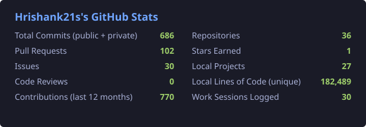

**I build practical software, automation, AI tools and hardware — taking ideas from *"can we build this?"* to something actually running.**

---

## 🚀 What I'm Building

| | |
| --- | --- |
| 🧩 **TableTracker** | Club-management software (bookings, billing, live tables) built around real-world workflows, running on Cloudflare Workers + D1. |
| ☕ **Weekend Rush Café** | QR ordering, Cashfree payments, chef dashboard and sales reports. |
| 🏆 **Club Tournament** | End-to-end pool tournament platform: registration, brackets, live matches, results. |
| 🤖 **AI & Dev Tooling** | Local AI, coding agents and automation — see [AgentOS](https://github.com/Hrishank21s/DIY-agent-OS). |
| 🛠️ **DIY / Hardware** | ESP and electronics projects alongside software. |

Most of this is under active, private development. Public work is below.

## ⭐ Featured

| Project | What it is |
| --- | --- |
| [**AgentOS**](https://github.com/Hrishank21s/DIY-agent-OS) | Self-hosted personal AI agent platform for macOS — Fastify + React + SQLite, with the OpenCode CLI as a swappable AI brain. |
| [**Portfolio site**](https://hrishank21s.github.io) | Overview of my work across AI, software, automation and hardware — [source](https://github.com/Hrishank21s/hrishank21s.github.io). |
| [**Kali Dinali**](https://github.com/Hrishank21s/kali-dinali-releases) | Android shop-management app — release builds and install guide. |

## 🧰 Tech I Use

## 📊 GitHub Stats

## 💡 Approach

> Build it. Test it. Break it. Fix it. Ship it.

I learn by building — turning rough ideas into working systems and improving them continuously.

